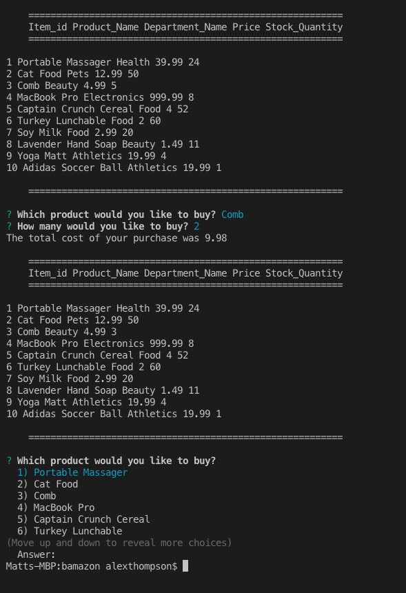

# bamazon
This is a Command Line Interface application made with NodeJS & MySQL. It was used to learn how to use the two technologies together. It is a simplified ecommerce platform where you can pick purchase products. 

I created the app while attending the University of Texas' Full Stack Development Bootcamp.  

Here is a screenshot of the code

